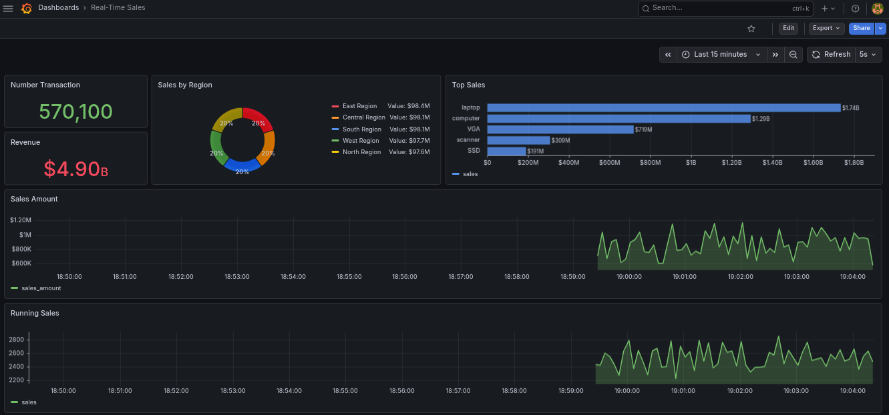

# Real-Time Click-Stream Analytics
Real-time data streaming using Kafka, Clickhouse &amp; Grafana

## *Project Overview*
A self‑contained demo (Docker‑Compose) that ingests click events from Kafka into ClickHouse, stores them in a MergeTree table, and creates a materialized view that continuously rolls up unique active transaction per 5s. The resulting metric is visualised in a live Grafana dashboard. The stack includes Kafka → ClickHouse Kafka engine → MergeTree storage → Materialized view → Grafana.

## *Problem To Be Solved*
- Websites and mobile apps generate huge volumes of click-stream data every second.
- Batch analytics often introduces delay, making insights too late for real-time decisions.
- Product and marketing teams need immediate visibility into:
  - Traffic spikes
  - User engagement
  - Campaign performance
  - Funnel drop-offs
  - UX or checkout issues
  - Traditional systems may struggle to ingest, store, and query high-volume event data at low latency.
  - The challenge is to build a pipeline that can handle high throughput while still supporting fast analytical queries.

## *Business Impact* 
  - Enables near real-time monitoring of user behavior.
  - Helps teams detect traffic spikes or product issues quickly.
  - Improves marketing campaign analysis by showing engagement as it happens.
  - Supports faster A/B testing decisions.
  - Reduces infrastructure complexity by using ClickHouse for both storage and aggregation.
  - Lowers latency from batch-style minutes or hours to seconds.
  - Gives product, marketing, and operations teams a single source of truth for user activity.

## *Business Leverage*
- ClickHouse provides major leverage because it can:
  - Ingest large volumes of data quickly
  - Store events efficiently
  - Run fast analytical queries
  - Maintain aggregated tables automatically
- The same architecture can be reused for:
  - Ad-tech analytics
  - IoT event monitoring
  - Log analytics
  - Product analytics
  - Fraud detection dashboards

## Prerequisite
Need to be installed on your system (mine: *cachyos*):
- Docker & docker-compose installed for docker build
  ```bash
  sudo pacman -S docker docker-compose buildx

  docker --version
  Docker version 29.5.2, build 79eb04c7d8

  docker-compose --version
  Docker Compose version 5.1.4
  ```
- Neovim for code editor and enhance with lazyvim
  ```bash
  sudo pacman -S neovim ripgrep fd git curl
  
  git clone https://github.com/LazyVim/starter ~/.config/nvim

  nvim --version
  NVIM v0.12.3
  Build type: RelWithDebInfo
  LuaJIT 2.1.1780076327
  Run "nvim -V1 -v" for more info  
  ```
- git for versioning control
  ```bash
  sudo pacman -S git
  
  git --version
  git version 2.54.0
  ```
- Web browser (Brave)
  ```bash
  yay -S brave-bin

  brave --version
  Brave Browser 149.1.91.172
  ```
- tmux for terminal multiplexer - to make easy workspace because all done terminal
  ```bash
  sudo pacman -S tmux
  ``` 

## *Project Flow*
- Create docker-compose.yml to collaborate Kafka - Clickhouse - Grafana, OR use existing docker of Kafka - Clickhouse - Grafana by creating docker network hence they can communicate each other:
    ```bash
  # checking active container
  CONTAINER ID   IMAGE                                 COMMAND                  CREATED       STATUS                  PORTS                                                                                                NAMES
  dc5c96f41fdc   clickhouse/clickhouse-server:latest   "/entrypoint.sh"         2 days ago    Up 2 days               0.0.0.0:8123->8123/tcp, [::]:8123->8123/tcp, 9009/tcp, 0.0.0.0:9002->9000/tcp, [::]:9002->9000/tcp   clickhouse-server
  8e4bdc2aef82   confluentinc/cp-kafka:7.6.1           "/etc/confluent/dock…"   3 days ago    Up 2 days (healthy)     9092/tcp, 0.0.0.0:29092->29092/tcp, [::]:29092->29092/tcp                                            kafka
  fb7ec05260d3   grafana/grafana                       "/run.sh"                3 weeks ago   Up 2 days               0.0.0.0:3000->3000/tcp, [::]:3000->3000/tcp                                                          observability-grafana-1

  # create docker network
  docker network create realtime-net

  # Add kafka to docker network
  docker metwork connect realtime-net kafka

  # Add grafana to docker network
  docker metwork connect realtime-net observability-grafana-1

  # Add clickhouse to docker network
  docker metwork connect realtime-net clickhouse-server  
   ```
- Create python code to simulate transaction as streaming and publish into kafka publisher
  ```python
    ...
    # kafka configuration
    KAFKA_BROKER = 'localhost:29092'
    KAFKA_TOPIC = 'sales_data'

    ...

    '''configure producer'''
    producer = Producer({
                'bootstrap.servers': KAFKA_BROKER,
                'client.id': 'sales-producer'
            })
    print(f'Starting producer ... Will generate up to {MAX_RECORDS:,} records')

    ...

    # Produce batch of the records
    for _ in range(min(BATCH_SIZE, MAX_RECORDS - record_count)):
      record = generate_sales_record(record_count)
      producer.produce(
        KAFKA_TOPIC,
        key=record['transaction_id'],
        value=json.dumps(record),
        callback=deliver_report
    )
   ```
- Create pyton code to consume data already publish by kafka
  ```python
    ...
    # Kafka configuration
    KAFKA_BROKER = 'localhost:29092'
    KAFKA_TOPIC = 'sales_data'
    KAFKA_GROUP = 'sales_consumer_group'

    # Clickhouse configuration
    CLICKHOUSE_HOST = 'localhost'
    CLICKHOUSE_PORT = 9002
    CLICKHOUSE_DATABASE = 'sales'
    CLICKHOUSE_TABLE = 'sales_data'
    CLICKHOUSE_USER = 'consumer'
    CLICKHOUSE_PASSWORD = 'clickhouse'
    ...

     # Ensure infrastructure exist
    ensure_topic_exists()
    ensure_clickhouse_table()

    # Configure Consumer
    consumer_config = {
        'bootstrap.servers': KAFKA_BROKER,
        'group.id': KAFKA_GROUP,
        'auto.offset.reset': 'earliest',
        'enable.auto.commit': False
    }

    ...

    # Insert batch when full
    if len(batch) >= batch_size:
        ch_client.execute(insert_query, batch)
        consumer.commit(msg)
        batch = []
    ...

  ```
- Setup Grafana for real-time monitoring
  - Open Grafana: http://localhost:3000 (login: admin / admin).
  - Add ClickHouse datasource
    - Name: clickhouse_ds
    - URL: http://clickhouse:8123
    - Database: sales
    - User: [user]
    - Password: [password]
- Create a Dashboard
  - Add a Time series panel.
  - Query (SQL) for real-time transaction monitoring:
      ```sql
      SELECT
        toStartOfSecond(toDateTime64(timestamp, 0)) AS time,
        sum(qty_sale) AS sales_qty,
        sum(item_price * qty_sale) AS sales_amount
      FROM sales_data
      WHERE timestamp >= (now() - toIntervalMinute(5))
      GROUP BY time
      ORDER BY time AS
      ```

## *Screenshot*

